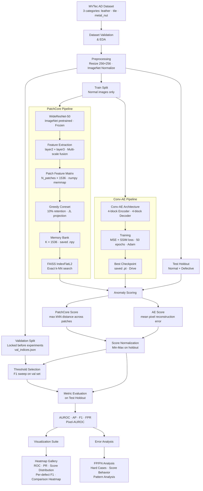

<div align="center">

# Unsupervised Industrial Defect Detection on MVTec AD Benchmark
### Comparative Analysis of Reconstruction-Based and Memory-Bank Approaches with Anomaly Localization

> A complete end-to-end ML pipeline implementing and comparing **PatchCore** (memory-bank) and **Convolutional Autoencoder** (reconstruction-based) for unsupervised industrial anomaly detection on the MVTec AD benchmark — covering feature extraction, anomaly scoring, pixel-level localization, evaluation, and error analysis.

[](https://python.org)
[](https://pytorch.org)
[](https://colab.research.google.com)
[](https://github.com/Fatahillah/industrial-anomaly-detection/blob/main/LICENSE)

</div>

---

## Table of Contents

<div align="center">

| 📌 **Overview** | |
|:---|:---|
| 1. [Project Overview](#1-project-overview) | 2. [Key Features](#2-key-features) |
| 3. [System Architecture](#3-system-architecture) | |

| 📂 **Data & Structure** | |
|:---|:---|
| 4. [Dataset](#4-dataset) | 5. [Project Structure](#5-project-structure) |

| ⚙️ **Technical Pipeline** | |
|:---|:---|
| 6. [End-to-End Pipeline](#6-end-to-end-pipeline) | 7. [Methodology](#7-methodology) |
| 8. [Anomaly Localization](#8-anomaly-localization) | 9. [Evaluation Metrics](#9-evaluation-metrics) |

| 📊 **Results & Analysis** | |
|:---|:---|
| 10. [Experiment Results](#10-experiment-results) | 11. [Visualization Results](#11-visualization-results) |
| 12. [Error Analysis](#12-error-analysis) | 13. [Comparative Analysis](#13-comparative-analysis) |

| 💡 **Discussion** | |
|:---|:---|
| 14. [Limitations](#14-limitations) | 15. [Future Work](#15-future-work) |

| 🚀 **Usage** | |
|:---|:---|
| 16. [How to Run](#16-how-to-run) | 17. [Requirements](#17-requirements) |
| 18. [Reproducibility](#18-reproducibility) | 19. [References](#19-references) |

</div>

---

## 1. Project Overview

### Industrial Defect Detection

In modern manufacturing, automated visual inspection is critical for maintaining product quality and reducing waste. Traditional supervised classifiers require large labeled defective datasets — impractical in real production environments where defect rates are below 0.1% and defect types may be unknown in advance.

### Unsupervised Anomaly Detection

This project addresses the problem using **one-class learning**: train exclusively on defect-free (normal) images, then flag any deviation from learned normality as anomalous at test time. No defective samples are needed during training.

### Why MVTec AD

[MVTec AD](https://www.mvtec.com/company/research/datasets/mvtec-ad) (Bergmann et al., CVPR 2019) is the de facto standard benchmark for industrial anomaly detection. It provides:
- 15 categories of industrial objects and textures
- High-resolution images with pixel-precise ground truth masks
- Standardized train/test splits enabling reproducible comparisons

### Research Objective

Implement and rigorously compare two paradigms for unsupervised anomaly detection on a 3-category MVTec AD subset:

| Paradigm | Method | Core Idea |
|---|---|---|
| **Memory-Bank** | PatchCore | Store normal patch features; detect anomalies via k-NN distance |
| **Reconstruction-Based** | Conv-AE | Reconstruct normal images; flag high reconstruction error as anomaly |

Both image-level (AUROC, AP, F1) and pixel-level (Pixel-AUROC) metrics are evaluated across all experiments.

---

## 2. Key Features

- **Zero-shot anomaly detection** — PatchCore requires no gradient updates, completing in under 30 minutes per category
- **Dual-paradigm comparison** — Reconstruction-based (Conv-AE) vs. Memory-bank (PatchCore) on identical evaluation protocol
- **Strict no-leakage evaluation** — Validation split locked before any experiment; threshold selection and metric evaluation on disjoint subsets
- **Pixel-level localization** — Anomaly heatmaps generated for every test image with GT mask overlay
- **Full visualization suite** — ROC curves, PR curves, score distributions, per-defect F1 charts, comparison heatmap
- **Evidence-based error analysis** — FP/FN galleries, hard case analysis, score behavior plots
- **Memory-safe pipeline** — numpy memmap for patch feature streaming; sequential category processing to prevent OOM on Colab free tier
- **Reproducible** — SEED=42 across all random operations; val indices locked in JSON before experiments

---

## 3. System Architecture



---

## 4. Dataset

### MVTec Anomaly Detection Dataset

| Attribute | Details |
|---|---|
| **Publisher** | MVTec Software GmbH (CVPR 2019) |
| **License** | CC BY-NC-SA 4.0 |
| **Total Categories** | 15 (10 object + 5 texture) |
| **Full Dataset Size** | 5,354 images, ~4.9 GB |
| **Resolution** | 700×700 to 1024×1024 px |
| **Ground Truth** | Pixel-precise binary masks for all defective test images |

### Categories Used in This Project

| Category | Type | Train Normal | Test Normal | Test Defective | Defect Types |
|---|---|---|---|---|---|
| **leather** | Texture | 245 | 32 | 92 | color, cut, fold, glue, poke |
| **tile** | Texture | 230 | 33 | 84 | crack, glue_strip, gray_stroke, oil, rough |
| **metal_nut** | Object | 220 | 22 | 93 | bent, color, flip, scratch |
| **Total** | | **695** | **87** | **269** | **14 defect types** |

> **Why these 3 categories?** They represent diverse challenges: leather (high intra-class texture variance), tile (regular structural patterns), and metal_nut (object with pose variation). Together they stress-test both detection paradigms across distinct failure modes.

### Validation Split (Locked)

| Category | Val Normal | Val Defective | Test Holdout |
|---|---|---|---|
| leather | 10 | 10 | 104 images |
| tile | 10 | 10 | 97 images |
| metal_nut | 5 | 10 | 100 images |

Validation indices are generated once with `SEED=42`, saved to `val_indices.json`, and never regenerated.

---

## 5. Project Structure

```
industrial-anomaly-detection/
│
├── notebooks/
│   ├── 00_environment_setup.ipynb      # Dependency install, Drive mount, config init
│   ├── 01_dataset_eda.ipynb            # Download, validate, EDA, val split
│   ├── 02_patchcore_pipeline.ipynb     # Feature extraction, coreset, scoring
│   ├── 03_autoencoder_training.ipynb   # Conv-AE training, checkpointing, scoring
│   ├── 04_evaluation_comparison.ipynb  # Normalization, threshold, all metrics
│   ├── 05_visualization.ipynb          # All publication-ready figures
│   └── 06_error_analysis.ipynb         # FP/FN, hard cases, limitations, insights
│
├── configs/                            # (on Google Drive)
│   ├── config.json                     # All paths and hyperparameters
│   ├── val_indices.json                # Locked validation split
│   └── thresholds.json                 # Norm params + optimal thresholds
│
├── models/                             # (on Google Drive)
│   ├── patchcore_leather.npy           # Memory bank (147 MB)
│   ├── patchcore_tile.npy              # Memory bank (138 MB)
│   ├── patchcore_metal_nut.npy         # Memory bank (132 MB)
│   ├── autoencoder_leather.pt          # Best checkpoint (12.4 MB)
│   ├── autoencoder_tile.pt             # Best checkpoint (12.4 MB)
│   └── autoencoder_metal_nut.pt        # Best checkpoint (12.4 MB)
│
├── results/                            # (on Google Drive)
│   ├── experiment_log.csv              # 6-experiment results table
│   ├── summary_results.json            # Aggregated metrics per method
│   ├── per_defect_results.json         # Per-defect-type F1 breakdown
│   ├── final_analysis.json             # Complete error analysis output
│   ├── patchcore_{cat}_scores.npy      # Anomaly scores (holdout)
│   ├── patchcore_{cat}_maps.npy        # Anomaly maps 32×32
│   ├── ae_{cat}_scores.npy             # AE anomaly scores
│   ├── ae_{cat}_maps.npy               # AE anomaly maps 256×256
│   ├── ae_loss_curve_{cat}.png         # Training loss curves
│   └── figures/
│       ├── roc_curve_all.png
│       ├── pr_curve_all.png
│       ├── score_distributions.png
│       ├── method_comparison_heatmap.png
│       ├── f1_per_defect_{cat}.png
│       ├── heatmaps/                   # 12 heatmap gallery files
│       ├── false_positives/            # 6 FP gallery files
│       └── analysis/                   # Error analysis figures
│
├── README.md
└── requirements.txt
```

---

## 6. End-to-End Pipeline

### Step 1 — Environment Setup (`00_environment_setup.ipynb`)

- Install missing packages: `faiss-cpu`, `pytorch-msssim`, `psutil`
- Mount Google Drive; verify mount path
- Define all path constants as single source of truth
- Auto-create all project directories (Drive + local `/content/`)
- Set `SEED=42` across Python, NumPy, PyTorch, CUDA
- Check GPU availability; log device info
- Write `config.json` with all hyperparameters to Drive

### Step 2 — Dataset Preparation (`01_dataset_eda.ipynb`)

- Download 3 MVTec AD categories via official mirror URLs
- Validate archive integrity before extraction
- Validate dataset structure: required folders, image counts, mask-image pairing
- Copy dataset from Drive to `/content/` for fast I/O
- Generate dataset statistics and EDA visualizations
- Lock validation split: `val_indices.json` generated with `SEED=42`, never regenerated

### Step 3 — PatchCore Feature Extraction (`02_patchcore_pipeline.ipynb`)

- Load WideResNet-50 (ImageNet pretrained, all parameters frozen)
- Register forward hooks on `layer2` (512ch) and `layer3` (1024ch)
- Stream patch features to `numpy.memmap` on local SSD — avoids RAM accumulation
- Multi-scale fusion: upsample layer3 → match layer2 spatial dims → concat → (B, 1536, H/8, W/8)
- Output: N_patches × 1536 feature matrix per category

### Step 4 — PatchCore Coreset & Memory Bank (`02_patchcore_pipeline.ipynb`)

- Random projection 1536→128 dims (Johnson-Lindenstrauss lemma) for efficient distance computation
- Vectorized greedy coreset: maintain `min_distances[N]` array, iteratively select farthest point
- Retain 10% of patches → memory bank (K × 1536)
- Build `faiss.IndexFlatL2` for exact k-NN search (k=9)
- Score test images: anomaly score = max k-NN distance across all patches

### Step 5 — Conv-AE Training (`03_autoencoder_training.ipynb`)

- Architecture: 4-block stride-2 encoder → 256×16×16 bottleneck → 4-block ConvTranspose decoder
- Loss: `0.8 × MSE + 0.2 × (1 - SSIM)` in [0,1] normalized space
- Optimizer: Adam (lr=1e-3, weight_decay=1e-5) with CosineAnnealingLR scheduler
- Mixed precision training: `autocast` + `GradScaler` → ~40% VRAM reduction
- Checkpointing: best model saved on loss improvement; emergency save every 10 epochs; resume-capable
- Score test images: anomaly score = mean per-pixel reconstruction error

### Step 6 — Evaluation (`04_evaluation_comparison.ipynb`)

- Min-max normalization fitted on test holdout only; applied to all splits
- Validation re-scoring: val images re-scored using saved model artifacts (memory banks + checkpoints)
- Threshold selection: F1 sweep on 1000 candidates over validation set
- Compute on test holdout: AUROC, AP, F1@threshold, FPR, Pixel-AUROC
- Per-defect-type F1 breakdown for all 14 defect types
- Save `experiment_log.csv` (6 rows) and `summary_results.json`

### Step 7 — Visualization (`05_visualization.ipynb`)

- Heatmap galleries: normal samples (2-panel) and defective samples (3-panel) per method/category
- False positive galleries: top-6 normal images with highest scores per method/category
- ROC curves and PR curves: 6 experiments per figure with operating points marked
- Score distribution KDE: normal vs defective per method/category
- Per-defect F1 bar charts: PatchCore vs Conv-AE side-by-side per category
- Method comparison heatmap: 4-metric × 2-method × 3-category overview

### Step 8 — Error Analysis (`06_error_analysis.ipynb`)

- Identify FP/FN indices with sorted score ordering
- FP gallery: normal images sorted by score descending (most confusing first)
- FN gallery: defective images sorted by score ascending (hardest to detect first)
- Hard case analysis: images that are FN in **both** methods simultaneously
- 4D comparison chart: sensitivity, specificity, localization, robustness
- Score behavior plot: easy / ambiguous / hard sample categorization per method/category
- Evidence-based pattern analysis, limitation documentation, future improvement directions

---

## 7. Methodology

### 7.1 Reconstruction-Based Approach — Conv-AE

The core hypothesis: *a model trained exclusively on normal images will reconstruct normal images well but fail on anomalous regions, producing high reconstruction error at defect locations.*

**Architecture:**

```
Input (B, 3, 256, 256)
    ↓
Encoder Block 1:  Conv2d(3,   32,  3, stride=2) → BN → LeakyReLU(0.2)  → (B, 32,  128, 128)
Encoder Block 2:  Conv2d(32,  64,  3, stride=2) → BN → LeakyReLU(0.2)  → (B, 64,   64,  64)
Encoder Block 3:  Conv2d(64,  128, 3, stride=2) → BN → LeakyReLU(0.2)  → (B, 128,  32,  32)
Encoder Block 4:  Conv2d(128, 256, 3, stride=2) → BN → LeakyReLU(0.2)  → (B, 256,  16,  16)
    ↓ [Bottleneck: 256 × 16 × 16 = 65,536 dim]
Decoder Block 1:  ConvTranspose2d(256, 128, 4, stride=2) → BN → ReLU   → (B, 128,  32,  32)
Decoder Block 2:  ConvTranspose2d(128, 64,  4, stride=2) → BN → ReLU   → (B, 64,   64,  64)
Decoder Block 3:  ConvTranspose2d(64,  32,  4, stride=2) → BN → ReLU   → (B, 32,  128, 128)
Decoder Block 4:  ConvTranspose2d(32,  3,   4, stride=2) → Sigmoid     → (B, 3,   256, 256)
```

**Parameters:** ~1.08M (lightweight for Colab T4)

**Loss Function:**
```
L = 0.8 × MSE(recon, target) + 0.2 × (1 − SSIM(recon, target))
```
Input is denormalized to [0,1] before loss computation. MSE alone produces blurry reconstructions; SSIM adds structural similarity awareness.

**Anomaly Scoring:**
```
error_map(x, y) = mean_channel[(recon(x,y) − target(x,y))²]
anomaly_score   = mean(error_map)        # image-level
anomaly_map     = error_map              # pixel-level (256×256)
```

### 7.2 Memory-Bank Approach — PatchCore

The core hypothesis: *patch-level features from a pretrained network encode rich texture and shape priors. Anomalies produce patch features that are far from all patches seen during training.*

**Feature Extraction:**
```
WideResNet-50 (68.9M params, frozen)
    ↓ Forward hooks
layer2: (B, 512,  H/8,  W/8)   ← 32×32 spatial grid for 256×256 input
layer3: (B, 1024, H/16, W/16)  ← 16×16 spatial grid
    ↓ Multi-scale fusion
Upsample layer3 → (B, 1024, H/8, W/8)   bilinear interpolation
Concat: (B, 1536, H/8, W/8)
Reshape: (B, 1024, 1536)                  1024 patch descriptors per image
```

**Coreset Subsampling:**
```
1. Random projection: 1536 → 128 dims (JL lemma, scale = 1/√128)
2. Initialize: select random seed point → selected = [s₀]
3. Maintain: min_distances[N] = inf
4. For k = 1 to K-1:
     dist_to_last = ||projected - projected[selected[-1]]||²
     min_distances = min(min_distances, dist_to_last)
     next = argmax(min_distances)
     selected.append(next)
5. Memory bank = original_features[selected]   shape: (K, 1536)
   where K = 0.10 × N_total_patches
```

**Anomaly Scoring:**
```
For each test image patch p_i:
    d_i = min_{m ∈ MemoryBank} ||p_i − m||₂

anomaly_map   = {d_i} reshaped to (32, 32)
anomaly_score = max(d_i)                    # max patch distance
```

---

## 8. Anomaly Localization

### PatchCore Localization

PatchCore naturally produces patch-level anomaly maps at 32×32 resolution (H/8 × W/8 for 256×256 input). For pixel-level evaluation, these are upsampled to 256×256 via bilinear interpolation.

```python
# Each spatial position maps to one patch descriptor
anomaly_map_32 = nn_distances.reshape(H_patch, W_patch)  # (32, 32)

# Upsample for visualization and Pixel-AUROC computation
anomaly_map_256 = cv2.resize(anomaly_map_32, (256, 256),
                              interpolation=cv2.INTER_LINEAR)
```

### Conv-AE Localization

Conv-AE produces full-resolution (256×256) reconstruction error maps directly:

```python
# Per-pixel squared error averaged over color channels
error_map = ((recon − target) ** 2).mean(dim=1)  # (B, H, W)
```

No upsampling required — maps are already at image resolution.

### Heatmap Generation

Both map types are visualized using the same pipeline:

```python
# Normalize map to [0, 1]
amap_norm = (amap − amap.min()) / (amap.max() − amap.min())

# Apply JET colormap: blue (low) → green → red (high)
heatmap = cv2.applyColorMap((amap_norm * 255).astype(np.uint8),
                             cv2.COLORMAP_JET)

# Alpha-blend with original image (α = 0.45)
overlay = 0.45 * heatmap + 0.55 * original_image
```

---

## 9. Evaluation Metrics

| Metric | Level | Description | Notes |
|---|---|---|---|
| **AUROC** | Image | Area under ROC curve | Threshold-independent; main detection metric |
| **Average Precision (AP)** | Image | Area under Precision-Recall curve | Better than AUROC for imbalanced datasets |
| **F1 @ Optimal Threshold** | Image | F1 at validation-derived threshold | Practical deployment metric |
| **FPR** | Image | False positive rate at threshold | Normal images flagged as defective |
| **Pixel-AUROC** | Pixel | AUROC at pixel level vs GT masks | Measures localization quality |
| **Per-Defect F1** | Image | F1 per defect type | Identifies which defects are hardest |

**No-leakage protocol:**
- AUROC and AP: computed on full test holdout (threshold-independent)
- F1 and FPR: threshold derived from validation set, evaluated on test holdout
- Pixel-AUROC: all test holdout pixel maps flattened, GT masks flattened, single roc_auc_score call

---

## 10. Experiment Results

### Main Results Table

| Method | Category | AUROC | AP | F1 | FPR | Pixel-AUROC | Threshold |
|---|---|---|---|---|---|---|---|
| **PatchCore** | leather | **1.0000** | **1.0000** | 0.9939 | 0.0455 | **0.9945** | 0.059 |
| **PatchCore** | tile | 0.9342 | 0.9779 | 0.9281 | 0.3478 | 0.9458 | 0.076 |
| **PatchCore** | metal_nut | **0.9972** | **0.9994** | 0.9765 | 0.2353 | **0.9807** | 0.115 |
| Conv-AE | leather | 0.5615 | 0.8677 | 0.7083 | 0.5000 | 0.8326 | 0.322 |
| Conv-AE | tile | 0.8813 | 0.9623 | 0.8974 | 0.5217 | 0.6837 | 0.064 |
| Conv-AE | metal_nut | 0.2991 | 0.7313 | 0.9071 | 1.0000 | 0.7282 | 0.000 |

### Aggregate Summary

| Metric | PatchCore | Conv-AE | Δ (PC − AE) |
|---|---|---|---|
| **Mean AUROC** | **0.9771** | 0.5806 | +0.3965 |
| **Mean AP** | **0.9924** | 0.8538 | +0.1386 |
| **Mean F1** | **0.9662** | 0.8376 | +0.1286 |
| **Mean FPR** | **0.2095** | 0.6739 | −0.4644 |
| **Mean Pixel-AUROC** | **0.9737** | 0.7482 | +0.2255 |

### Per-Defect-Type F1

**Leather**

| Defect | PatchCore | Conv-AE |
|---|---|---|
| color | 1.0000 | 0.8966 |
| cut | 1.0000 | **0.3000** |
| fold | 1.0000 | 0.8966 |
| glue | 1.0000 | 0.5217 |
| poke | 1.0000 | 1.0000 |

**Tile**

| Defect | PatchCore | Conv-AE |
|---|---|---|
| crack | 1.0000 | 1.0000 |
| glue_strip | 1.0000 | 0.9655 |
| gray_stroke | 0.9231 | 0.8800 |
| oil | 1.0000 | 1.0000 |
| rough | 0.9600 | **1.0000** ← AE wins |

**Metal Nut**

| Defect | PatchCore | Conv-AE |
|---|---|---|
| bent | 1.0000 | 1.0000 |
| color | 1.0000 | 1.0000 |
| flip | 1.0000 | 1.0000 |
| scratch | 1.0000 | 1.0000 |

> **Notable finding:** Conv-AE achieves F1=1.00 on tile-rough vs PatchCore's 0.96 — the only case where reconstruction-based approach outperforms the memory-bank method. This suggests AE has competitive advantage for defects that alter global surface texture uniformity.

### Blueprint Success Criteria

| Criterion | Target | Achieved | Status |
|---|---|---|---|
| PatchCore AUROC ≥ 0.90 on ≥2 categories | 2/3 | 3/3 | ✅ Exceeded |
| Conv-AE AUROC ≥ 0.75 on all categories | 3/3 | 1/3 (tile only) | ❌ Partial |
| Pixel-AUROC PatchCore ≥ 0.85 on ≥2 categories | 2/3 | 3/3 | ✅ Exceeded |

---

## 11. Visualization Results

All figures are saved to `results/figures/` on Google Drive.

### Anomaly Heatmap Gallery

For each `(method, category)` combination, two galleries are generated:
- **Normal samples** (5 images): 2-panel `[Original | Heatmap Overlay]`
- **Defective samples** (5 images): 3-panel `[Original | GT Mask | Heatmap Overlay]`

```
results/figures/heatmaps/
├── patchcore_leather_normal.png
├── patchcore_leather_defective.png
├── autoencoder_leather_normal.png
├── autoencoder_leather_defective.png
└── ... (12 files total)
```

### ROC and PR Curves

Both figures contain all 6 experiments (2 methods × 3 categories) in 3 subplots (one per category). Operating points at optimal threshold are marked with dots on ROC curves.

### Score Distribution

2×3 KDE plot grid showing normal vs. defective score distributions per method/category, with threshold line and ambiguous zone shading.

**Key visual insights:**
- PatchCore leather: near-zero overlap between normal (green) and defective (red) — confirms AUROC=1.000
- Conv-AE metal_nut: normal distribution lies *right* of defective — inverted discrimination, confirms AUROC=0.299

### Method Comparison Heatmap

4-panel heatmap (AUROC · AP · F1 · Pixel-AUROC) with RdYlGn colormap, annotated with exact values. Provides quick visual summary for paper figures.

---

## 12. Error Analysis

### Error Case Summary

| Method | Category | FP Count | FP Rate | FN Count | FN Rate |
|---|---|---|---|---|---|
| PatchCore | leather | 1 | 0.045 | 0 | **0.000** |
| PatchCore | tile | 8 | 0.348 | 3 | 0.041 |
| PatchCore | metal_nut | 4 | 0.235 | 0 | **0.000** |
| Conv-AE | leather | 11 | 0.500 | 31 | 0.378 |
| Conv-AE | tile | 12 | 0.522 | 4 | 0.054 |
| Conv-AE | metal_nut | 17 | 1.000 | 0 | 0.000 |

### False Positive Patterns

**PatchCore:**
- Tile FP (8 cases): Normal tile images with irregular grout lines or edge regions whose local patch features overlap with rough/oil defect patch neighborhoods in the memory bank
- Metal_nut FP (4 cases): Normal images with extreme viewing angles not well-covered by training distribution

**Conv-AE:**
- Leather FP (11 cases): Normal leather images with high intra-class texture variation trigger elevated reconstruction error — model cannot distinguish natural variation from defects
- Metal_nut FP (17 cases / FPR=1.0): Complete threshold collapse — all images predicted as anomalous

### False Negative Patterns

**PatchCore:**
- PatchCore achieves FN=0 on leather and metal_nut — all defects detected
- Tile FN (3 cases): Defects with subtle local texture change that closely resemble normal tile patches in feature space

**Conv-AE:**
- Leather FN (31 cases, FN_rate=0.378): Fine-grained defects (cut, glue) produce reconstruction error indistinguishable from normal texture variation
- Conv-AE achieves FN=0 on metal_nut only because FPR=1.000 — the "detection" is trivially achieved by predicting everything as anomalous

### Hard Cases (Both Methods Failed)

Only **1 hard case** identified across all experiments: a single tile image where both PatchCore and Conv-AE failed to detect the defect.

Visual analysis shows: the defect (irregular glue-like region in center) closely resembles normal tile texture variation. PatchCore produces activation in the correct region but insufficient aggregate score; Conv-AE shows near-zero activation. This represents a fundamental detection boundary beyond methodology choice.

### Score Behavior Analysis

The score behavior strip plot categorizes every test sample into:
- **Easy detect**: score ≥ threshold + 0.1 (high confidence TP)
- **Ambiguous**: |score − threshold| < 0.1 (decision boundary region)
- **Missed FN**: score < threshold (undetected defect)
- **Near-FP**: normal image with score ≥ threshold − 0.1

Key finding from score behavior: PatchCore tile has 20 defective samples in the ambiguous zone — explaining its elevated FPR and the 3 FN cases. The decision boundary is genuinely uncertain for tile, suggesting either a tighter coreset or domain-adapted features would help.

---

## 13. Comparative Analysis

### Method Comparison across 4 Dimensions

| Dimension | PatchCore | Conv-AE | Winner |
|---|---|---|---|
| **Sensitivity (AUROC)** | Mean 0.977 | Mean 0.581 | PatchCore |
| **Specificity (1−FPR)** | Mean 0.791 | Mean 0.326 | PatchCore |
| **Localization (Pixel-AUROC)** | Mean 0.974 | Mean 0.748 | PatchCore |
| **Robustness (Mean per-defect F1)** | Mean 0.984 | Mean 0.898 | PatchCore |

### Detailed Comparison

| Aspect | PatchCore | Conv-AE |
|---|---|---|
| **Training required** | ❌ None | ✅ ~20 min total |
| **Coreset build time** | ⚠️ ~119 min total | N/A |
| **Inference memory** | 132–147 MB per category | ~12 MB checkpoint |
| **Texture categories** | Excellent (leather AUROC=1.00) | Poor (leather AUROC=0.56) |
| **Object categories** | Excellent (metal_nut AUROC=0.997) | Fails (metal_nut AUROC=0.30) |
| **Structural defects** | Strong (tile AUROC=0.934) | Competitive (tile AUROC=0.881) |
| **Pixel-level precision** | High (32×32 maps, sharp) | Medium (256×256 maps, blurred) |
| **Pose invariance** | ✅ Memory bank covers all poses | ❌ No geometric invariance |
| **Backbone dependency** | WideResNet-50 (ImageNet) | None (trained from scratch) |

### When Each Method is Preferred

**Use PatchCore when:**
- Production deployment with reliable GPU/RAM available
- Rapid deployment needed (no training required)
- Categories with texture or moderate pose variation
- Pixel-level localization quality is critical
- No labeled defective samples available at all

**Use Conv-AE when:**
- Memory-constrained inference environment (~12 MB vs ~140 MB)
- Defects are structurally distinctive (cracks, foreign material)
- As a lightweight baseline or ensemble component
- Budget is limited for inference hardware

---

## 14. Limitations

### PatchCore

1. **Memory-intensive inference**
   Memory banks: leather=147MB, tile=138MB, metal_nut=132MB. At 10% coreset, full (pre-coreset) feature matrix reaches ~1.4GB per category. Scales with training set size.

2. **ImageNet feature extractor dependency**
   WideResNet-50 was trained on natural images. For industrial domains far from ImageNet distribution, feature representation may be suboptimal — evidenced by tile FPR=0.348 where grout regions share feature space with defect patches.

3. **Slow coreset construction**
   Greedy coreset: ~44min (leather), ~38min (tile), ~35min (metal_nut) on T4 GPU. Total ~119 minutes dominated by CPU-bound numpy distance computation. Unsuitable for online learning scenarios.

### Conv-AE

1. **Reconstruction bias**
   AE learns to reconstruct the mean appearance of training images. For categories with high intra-class texture variance (leather), normal and defective reconstruction quality become indistinguishable.

2. **No geometric invariance**
   No explicit mechanism for handling object orientation. Non-canonical poses produce reconstruction error spikes exceeding defect-induced errors — causing AUROC=0.299 on metal_nut.

3. **Fixed bottleneck capacity**
   256×16×16=65,536 dim bottleneck (3:1 compression ratio) discards fine-grained texture details. Evidence: leather cut F1=0.30 vs poke F1=1.00 — subtle linear discontinuities are compressed out.

4. **Convergence dependency**
   Best epoch at 50/50 for leather and tile indicates undertrained models. 50 epochs insufficient for full convergence; extended training (100-150 epochs) expected to improve AE performance.

---

## 15. Future Work

### PatchCore Improvements

| Direction | Addresses | Expected Impact |
|---|---|---|
| FAISS k-means coreset | Slow greedy construction (119min) | 10-20× speedup |
| Domain-adapted backbone (SimCLR/DINO) | ImageNet feature misalignment, tile FPR=0.348 | FPR reduction on specialized textures |
| Add layer4 to multi-scale fusion | Subtle global anomalies missed at patch level | Improved detection of structural defects |

### Conv-AE Improvements

| Direction | Addresses | Expected Impact |
|---|---|---|
| Variational AE (VAE) with KL regularization | Reconstruction bias on leather | Structured latent space → richer anomaly signal |
| Perceptual loss (VGG feature matching) | Blurry maps, Pixel-AUROC gap | Sharper heatmaps, better localization |
| Geometric augmentation (rotation 0-360°) | Pose collapse on metal_nut | Orientation-invariant normality model |
| DRAEM-style discriminative head | Fine-grained defect detection (leather cut F1=0.30) | Explicit anomaly region learning |

### Architecture Directions

- **Transformer backbone** (ViT, DeiT): Self-attention captures global context for object-level anomaly detection
- **Flow-based normalization** (FastFlow, CSFlow): Exact likelihood estimation for more principled anomaly scoring
- **Diffusion-based reconstruction**: DDPM-based anomaly detection for higher-fidelity reconstruction and sharper error maps

---

## 16. How to Run

### Prerequisites

- Google Colab account (free tier with T4 GPU)
- Google Drive (~3 GB free space)
- Internet connection for dataset download (~1 GB total for 3 categories)

### Setup

```bash
# Clone repository
git clone https://github.com/f4tahitsYours/mvtec-anomaly-detection.git
cd industrial-anomaly-detection
```

### Execution Order

Run notebooks **sequentially** — each notebook depends on outputs of the previous:

```
1. 00_environment_setup.ipynb    → Initialize config.json, create all directories
2. 01_dataset_eda.ipynb          → Download dataset, validate, lock val split
3. 02_patchcore_pipeline.ipynb   → Build memory banks, score test images
4. 03_autoencoder_training.ipynb → Train Conv-AE, score test images
5. 04_evaluation_comparison.ipynb → Compute all metrics, save experiment_log.csv
6. 05_visualization.ipynb        → Generate all figures
7. 06_error_analysis.ipynb       → Error analysis, final insights
```

### Session Resume

After a Colab session disconnect, all notebooks include a **restore cell** that copies the dataset from Drive back to `/content/`. Simply re-run from the top of whichever notebook was interrupted.

```python
# This cell is included in notebooks 02–06
# It automatically detects and restores the local dataset
for cat in CATEGORIES:
    dest_ok = (os.path.exists(f'{LOCAL_DATA}/{cat}/train/good') and
               len(os.listdir(f'{LOCAL_DATA}/{cat}/train/good')) > 0)
    if not dest_ok:
        shutil.copytree(f'{DATASET_DRIVE}/{cat}', f'{LOCAL_DATA}/{cat}')
```

---

## 17. Requirements

```txt
# Core ML
torch>=2.0.0
torchvision>=0.15.0
pytorch-msssim==1.0.0

# Anomaly detection
faiss-cpu>=1.7.4

# Data & evaluation
scikit-learn>=1.3.0
numpy>=1.24.0
pandas>=2.0.0
Pillow>=9.5.0
opencv-python>=4.8.0

# Visualization
matplotlib>=3.7.0
seaborn>=0.13.0

# Utilities
tqdm>=4.65.0
psutil>=5.9.0
```

> **Note on torch version:** Do NOT pin torch to a specific version in Colab. Colab ships with a CUDA-matched PyTorch build. Installing a different version breaks CUDA compatibility. The notebooks install only packages absent from Colab's default environment (`faiss-cpu`, `pytorch-msssim`, `psutil`).

---

## 18. Reproducibility

### Random Seed Control

All random sources are seeded with `SEED=42` before any experiment:

```python
import random, numpy as np, torch

SEED = 42
random.seed(SEED)
np.random.seed(SEED)
torch.manual_seed(SEED)
torch.cuda.manual_seed_all(SEED)
torch.backends.cudnn.deterministic = True
torch.backends.cudnn.benchmark     = False
```

### Deterministic Operations

`torch.backends.cudnn.deterministic = True` ensures reproducible CUDA operations. Note: this may reduce throughput by ~5-10% compared to non-deterministic mode.

### Locked Validation Split

`val_indices.json` is generated **once** in Notebook 01 and **never regenerated**. The file contains absolute paths to all validation images. A guard prevents overwrite:

```python
if os.path.exists(VAL_INDICES_PATH):
    print("⚠️  val_indices.json already exists — NOT overwritten.")
else:
    # Generate and save
```

### Experiment Reproducibility Checklist

| Component | Controlled By |
|---|---|
| Validation split | `val_indices.json` (SEED=42, locked) |
| Coreset selection | Deterministic greedy with `np.random.default_rng(SEED=42)` |
| AE weight initialization | `torch.manual_seed(SEED)` before model build |
| Data loading order | `shuffle=False` for test loaders; `shuffle=True` only for AE training |
| Threshold selection | Deterministic F1 sweep with fixed `np.linspace(0, 1, 1000)` |
| Score normalization | Min-max with params stored in `thresholds.json` |

---

## 19. References

### Papers

1. **PatchCore (Roth et al., 2022)**
   Roth, K., Pemula, L., Zepeda, J., Schölkopf, B., Brox, T., & Gehler, P. (2022).
   *Towards Total Recall in Industrial Anomaly Detection.*
   Proceedings of the IEEE/CVF Conference on Computer Vision and Pattern Recognition (CVPR), 14318–14328.
   [arXiv:2106.08265](https://arxiv.org/abs/2106.08265)

2. **MVTec AD Dataset (Bergmann et al., 2019)**
   Bergmann, P., Fauser, M., Sattlegger, D., & Steger, C. (2019).
   *MVTec AD — A Comprehensive Real-World Dataset for Unsupervised Anomaly Detection.*
   Proceedings of the IEEE/CVF Conference on Computer Vision and Pattern Recognition (CVPR), 9592–9600.
   [Paper link](https://openaccess.thecvf.com/content_CVPR_2019/papers/Bergmann_MVTec_AD_--_A_Comprehensive_Real-World_Dataset_for_Unsupervised_Anomaly_CVPR_2019_paper.pdf)

3. **SPADE (Cohen & Hoshen, 2020)**
   Cohen, N., & Hoshen, Y. (2020).
   *Sub-Image Anomaly Detection with Deep Pyramid Correspondences.*
   [arXiv:2005.02357](https://arxiv.org/abs/2005.02357)

4. **DRAEM (Zavrtanik et al., 2021)**
   Zavrtanik, V., Kristan, M., & Skočaj, D. (2021).
   *DRAEM — A discriminatively trained reconstruction embedding for surface anomaly detection.*
   Proceedings of the IEEE/CVF International Conference on Computer Vision (ICCV), 8330–8339.
   [arXiv:2108.07610](https://arxiv.org/abs/2108.07610)

5. **Autoencoder for Anomaly Detection (Baur et al., 2021)**
   Baur, C., Wiestler, B., Albarqouni, S., & Navab, N. (2021).
   *Autoencoders for Unsupervised Anomaly Segmentation in Brain MR Images: A Comparative Study.*
   Medical Image Analysis, 69, 101952.

6. **WideResNet (Zagoruyko & Komodakis, 2016)**
   Zagoruyko, S., & Komodakis, N. (2016).
   *Wide Residual Networks.*
   British Machine Vision Conference (BMVC).
   [arXiv:1605.07146](https://arxiv.org/abs/1605.07146)

### Libraries

| Library | Version | Usage |
|---|---|---|
| PyTorch | ≥2.0.0 | Model training, inference |
| torchvision | ≥0.15.0 | WideResNet-50 pretrained weights |
| FAISS | 1.7.4 | k-NN search for PatchCore |
| pytorch-msssim | 1.0.0 | SSIM component of AE loss |
| scikit-learn | ≥1.3.0 | AUROC, AP, F1 computation |
| OpenCV | ≥4.8.0 | Heatmap generation, image loading |

---

## Acknowledgements

Dataset: [MVTec AD](https://www.mvtec.com/company/research/datasets/mvtec-ad) — © MVTec Software GmbH, licensed under CC BY-NC-SA 4.0.

Compute: [Google Colab](https://colab.research.google.com) free tier (T4 GPU, 15.64 GB VRAM, 13.6 GB RAM).

---